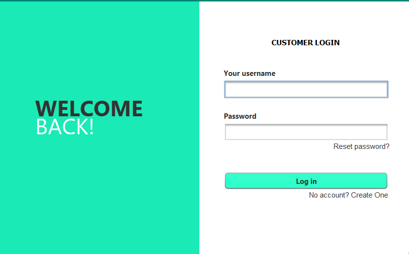
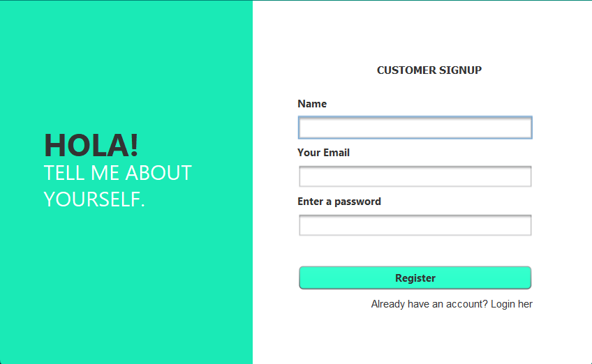
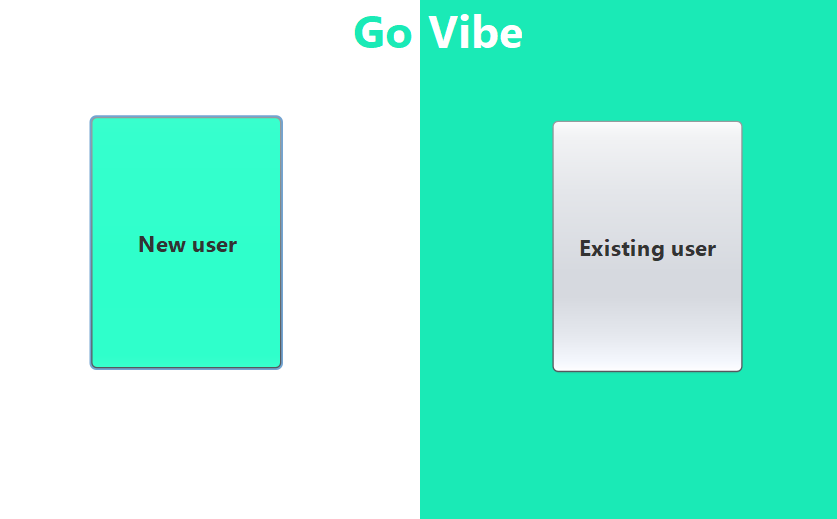
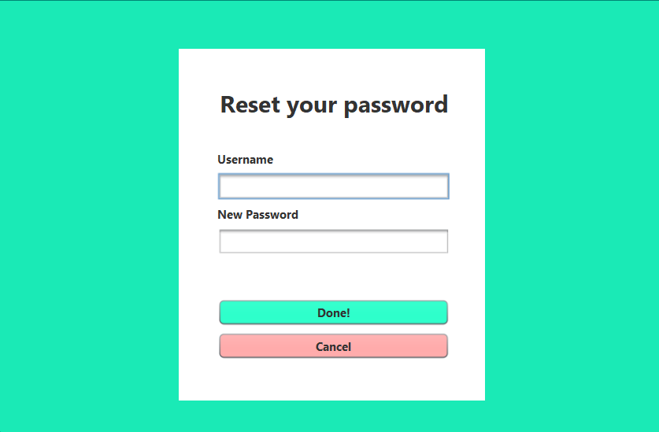

# **GoVibe: Travel Management System**

GoVibe is a simple yet powerful travel management system that enables users to register, log in, and find travel guides and destinations. The project is developed using Java in **NetBeans** IDE and uses **MySQL** (via XAMPP) to store data locally.

---

## **Features**

- **User Registration and Login**:  
  - New users can sign up by providing their details.
  - Existing users can log in to access the app.

- **Travel Guides and Destinations**:  
  - After logging in, users can browse available travel guides and explore various destinations.

- **Password Reset Functionality**:  
  - Users can reset their password in case they forget it.

- **Local Database Storage**:  
  - The app uses a MySQL database to store user information and travel data.  
  - XAMPP is used to manage the database locally.

---

## **How to Get Started**

1. Clone the repository or download the source code.
2. Set up XAMPP and start Apache and MySQL services.
3. Import the provided SQL file into your MySQL database to create the necessary tables.
4. Open the project in **NetBeans IDE**.
5. Run the project and start exploring GoVibe!

---

## **Database Setup**

1. Launch XAMPP and start Apache and MySQL.
2. Open **phpMyAdmin** and create a new database named `govibe_db`.
3. Import the SQL file provided in the `db` folder to set up the necessary tables.
4. Ensure the database connection details in the code (e.g., username, password, database name) match your local setup.

---

## **Screenshots**

  
    
    

  
    
    

*Figure 1: Login screen (top-left), Signup screen (top-right), Home screen (bottom-left), Reset Password screen (bottom-right)*

---

## **Contribution**

Contributions are welcome! If you'd like to enhance GoVibe or fix any issues, feel free to fork the repository and submit a pull request.

